# ER del esquema realmente implementado

> **Generado**, no escrito a mano: `pnpm reconcile:r0 --write` lo deriva de
> `supabase/migrations/*.sql`. Un ER redactado a mano describe lo que alguien
> creyó implementar; éste describe lo que las migraciones crean. Si alguien
> agrega una tabla sin regenerarlo, `pnpm reconcile:r0` falla.

## Alcance verificado

| Métrica | Real | Esperado |
|---|---:|---:|
| Tablas | 78 | 78 |
| Migraciones | 13 | `0000`–`0090` |
| Tablas con RLS habilitada | 78 | 78 |
| Entradas de registro de rutas | 58 | 58 |
| Paths distintos servidos | 53 | 53 |

Las migraciones son artefactos **autorizados pero no ejecutados** en esta
máquina: no hay Docker ni Supabase CLI, así que este ER refleja el SQL fuente
revisado estáticamente, no un `information_schema` consultado. Ver
`docs/runbooks/database-reset.md`.

## Identidad, tenancy y aislamiento — `0010_identity_tenancy_isolation.sql`

| Tabla | Columnas | RLS | Referencias a |
|---|---:|:---:|---|
| `user_profiles` | 7 | sí | `auth.users` |
| `organizations` | 9 | sí | `auth.users` |
| `organization_slug_history` | 6 | sí | `organizations`, `auth.users` |
| `organization_branches` | 8 | sí | `organizations` |
| `permissions` | 3 | sí | — |
| `role_templates` | 2 | sí | — |
| `role_template_permissions` | 2 | sí | `role_templates`, `permissions` |
| `organization_memberships` | 11 | sí | `auth.users`, `organizations` |
| `membership_roles` | 4 | sí | `organization_memberships`, `role_templates` |
| `membership_branch_scopes` | 8 | sí | `organization_memberships`, `organizations`, `organization_branches`, `auth.users` |
| `organization_settings` | 7 | sí | `organizations` |
| `organization_counters` | 4 | sí | `organizations` |
| `platform_memberships` | 8 | sí | `auth.users` |
| `platform_role_templates` | 2 | sí | — |
| `platform_role_permissions` | 2 | sí | `platform_role_templates`, `permissions` |
| `platform_membership_roles` | 4 | sí | `platform_memberships`, `platform_role_templates` |
| `support_access_sessions` | 14 | sí | `platform_memberships`, `organizations`, `auth.users` |

## CRM — `0020_crm.sql`

| Tabla | Columnas | RLS | Referencias a |
|---|---:|:---:|---|
| `customers` | 8 | sí | `organizations`, `auth.users` |
| `customer_contacts` | 11 | sí | `auth.users`, `customers` |
| `customer_auth_links` | 11 | sí | `auth.users`, `customers` |
| `customer_consents` | 8 | sí | `auth.users`, `customers` |
| `customer_communication_preferences` | 7 | sí | `customers` |

## Vehículos y acceso — `0030_vehicles_access.sql`

| Tabla | Columnas | RLS | Referencias a |
|---|---:|:---:|---|
| `vehicles` | 9 | sí | `auth.users` |
| `vehicle_identifiers` | 7 | sí | `vehicles`, `organizations`, `auth.users` |
| `vehicle_ownership_claims` | 7 | sí | `vehicles`, `auth.users`, `customers` |
| `vehicle_ownerships` | 8 | sí | `vehicles`, `auth.users`, `vehicle_ownership_claims`, `organizations` |
| `vehicle_access_grants` | 10 | sí | `organizations`, `vehicles`, `auth.users`, `customers` |
| `vehicle_odometer_events` | 12 | sí | `vehicles`, `organizations`, `auth.users` |

## Catálogo — `0040_catalog.sql`

| Tabla | Columnas | RLS | Referencias a |
|---|---:|:---:|---|
| `service_catalog_items` | 8 | sí | — |
| `service_catalog_versions` | 16 | sí | `service_catalog_items`, `auth.users` |
| `service_catalog_overrides` | 17 | sí | `organizations`, `service_catalog_items`, `auth.users` |
| `labor_operations` | 10 | sí | `service_catalog_items` |

## Intake y casos — `0050_intake_cases.sql`

| Tabla | Columnas | RLS | Referencias a |
|---|---:|:---:|---|
| `intake_threads` | 7 | sí | `organizations`, `auth.users`, `customers` |
| `intake_entries` | 8 | sí | `auth.users`, `intake_threads` |
| `cases` | 13 | sí | `organizations`, `organization_branches`, `vehicles`, `auth.users`, `customers`, `intake_threads` |
| `case_participants` | 8 | sí | `auth.users`, `cases`, `customers` |
| `case_assignments` | 10 | sí | `auth.users`, `cases` |
| `service_requests` | 8 | sí | `auth.users`, `cases`, `intake_entries` |
| `reported_symptoms` | 10 | sí | `auth.users`, `cases`, `service_requests`, `intake_entries` |
| `case_notes` | 7 | sí | `auth.users`, `cases` |
| `case_status_events` | 10 | sí | `auth.users`, `cases` |
| `case_blockers` | 11 | sí | `auth.users`, `cases` |

## Agenda — `0060_scheduling.sql`

| Tabla | Columnas | RLS | Referencias a |
|---|---:|:---:|---|
| `resources` | 8 | sí | `organizations`, `organization_branches` |
| `resource_capabilities` | 5 | sí | `resources` |
| `resource_schedules` | 5 | sí | `resources` |
| `capacity_blocks` | 9 | sí | `auth.users`, `resources` |
| `appointments` | 15 | sí | `organizations`, `organization_branches`, `auth.users`, `cases` |
| `appointment_resources` | 5 | sí | `appointments`, `resources` |
| `assignment_events` | 9 | sí | `auth.users`, `appointments` |
| `resource_reservations` | 12 | sí | `auth.users`, `resources`, `appointments` |

## Inspección y evidencia — `0070_inspection_evidence.sql`

| Tabla | Columnas | RLS | Referencias a |
|---|---:|:---:|---|
| `inspection_templates` | 5 | sí | — |
| `inspection_template_versions` | 8 | sí | `inspection_templates`, `auth.users` |
| `inspection_template_sections` | 6 | sí | `inspection_template_versions` |
| `inspection_template_items` | 10 | sí | `inspection_template_versions`, `inspection_template_sections` |
| `inspections` | 15 | sí | `organizations`, `vehicles`, `inspection_template_versions`, `auth.users`, `inspections`, `cases` |
| `inspection_results` | 13 | sí | `inspection_template_items`, `auth.users`, `inspections` |
| `measurements` | 9 | sí | `auth.users`, `inspection_results` |
| `findings` | 11 | sí | `auth.users`, `cases`, `inspections`, `inspection_results` |
| `maintenance_recommendations` | 14 | sí | `vehicles`, `auth.users`, `cases`, `findings` |
| `upload_intents` | 12 | sí | `organizations`, `auth.users`, `cases` |
| `evidence_assets` | 18 | sí | `organizations`, `auth.users`, `evidence_assets`, `upload_intents` |
| `evidence_links` | 12 | sí | `auth.users`, `evidence_assets` |

## Cotización y autorización — `0080_quote_authorization.sql`

| Tabla | Columnas | RLS | Referencias a |
|---|---:|:---:|---|
| `quotes` | 5 | sí | `organizations`, `auth.users`, `cases` |
| `quote_versions` | 18 | sí | `organizations`, `auth.users`, `quote_versions`, `quotes`, `cases` |
| `quote_items` | 17 | sí | `auth.users`, `quote_versions` |
| `authorization_requests` | 21 | sí | `organizations`, `auth.users`, `quote_versions`, `cases`, `customers` |
| `authorization_access_tokens` | 17 | sí | `organizations`, `authorization_requests`, `customers` |
| `authorizations` | 16 | sí | `organizations`, `auth.users`, `authorization_requests`, `quote_versions`, `cases`, `customers` |
| `authorization_items` | 12 | sí | `authorizations`, `quote_versions`, `quote_items` |
| `authorization_events` | 7 | sí | `auth.users`, `authorization_requests`, `authorizations`, `cases` |

## Confianza transaccional — `0085_transactional_trust.sql`

| Tabla | Columnas | RLS | Referencias a |
|---|---:|:---:|---|
| `domain_events` | 9 | sí | `organizations`, `auth.users`, `customers` |
| `outbox_messages` | 12 | sí | `organizations`, `domain_events` |
| `audit_events` | 9 | sí | `organizations`, `auth.users` |
| `idempotency_keys` | 4 | sí | `organizations` |

## Feature flags — `0086_features.sql`

| Tabla | Columnas | RLS | Referencias a |
|---|---:|:---:|---|
| `feature_flags` | 7 | sí | — |
| `feature_flag_overrides` | 7 | sí | `organizations`, `feature_flags`, `auth.users` |

## Documentos — `0087_documents.sql`

| Tabla | Columnas | RLS | Referencias a |
|---|---:|:---:|---|
| `documents` | 8 | sí | `organizations`, `auth.users`, `cases` |
| `document_versions` | 16 | sí | `document_versions`, `auth.users`, `documents` |

## Diagrama de relaciones

```mermaid
erDiagram
  organizations ||--o{ organization_slug_history : ""
  organizations ||--o{ organization_branches : ""
  role_templates ||--o{ role_template_permissions : ""
  permissions ||--o{ role_template_permissions : ""
  organizations ||--o{ organization_memberships : ""
  organization_memberships ||--o{ membership_roles : ""
  role_templates ||--o{ membership_roles : ""
  organization_memberships ||--o{ membership_branch_scopes : ""
  organizations ||--o{ membership_branch_scopes : ""
  organization_branches ||--o{ membership_branch_scopes : ""
  organizations ||--o{ organization_settings : ""
  organizations ||--o{ organization_counters : ""
  platform_role_templates ||--o{ platform_role_permissions : ""
  permissions ||--o{ platform_role_permissions : ""
  platform_memberships ||--o{ platform_membership_roles : ""
  platform_role_templates ||--o{ platform_membership_roles : ""
  platform_memberships ||--o{ support_access_sessions : ""
  organizations ||--o{ support_access_sessions : ""
  organizations ||--o{ customers : ""
  customers ||--o{ customer_contacts : ""
  customers ||--o{ customer_auth_links : ""
  customers ||--o{ customer_consents : ""
  customers ||--o{ customer_communication_preferences : ""
  vehicles ||--o{ vehicle_identifiers : ""
  organizations ||--o{ vehicle_identifiers : ""
  vehicles ||--o{ vehicle_ownership_claims : ""
  customers ||--o{ vehicle_ownership_claims : ""
  vehicles ||--o{ vehicle_ownerships : ""
  vehicle_ownership_claims ||--o{ vehicle_ownerships : ""
  organizations ||--o{ vehicle_ownerships : ""
  organizations ||--o{ vehicle_access_grants : ""
  vehicles ||--o{ vehicle_access_grants : ""
  customers ||--o{ vehicle_access_grants : ""
  vehicles ||--o{ vehicle_odometer_events : ""
  organizations ||--o{ vehicle_odometer_events : ""
  service_catalog_items ||--o{ service_catalog_versions : ""
  organizations ||--o{ service_catalog_overrides : ""
  service_catalog_items ||--o{ service_catalog_overrides : ""
  service_catalog_items ||--o{ labor_operations : ""
  organizations ||--o{ intake_threads : ""
  customers ||--o{ intake_threads : ""
  intake_threads ||--o{ intake_entries : ""
  organizations ||--o{ cases : ""
  organization_branches ||--o{ cases : ""
  vehicles ||--o{ cases : ""
  customers ||--o{ cases : ""
  intake_threads ||--o{ cases : ""
  cases ||--o{ case_participants : ""
  customers ||--o{ case_participants : ""
  cases ||--o{ case_assignments : ""
  cases ||--o{ service_requests : ""
  intake_entries ||--o{ service_requests : ""
  cases ||--o{ reported_symptoms : ""
  service_requests ||--o{ reported_symptoms : ""
  intake_entries ||--o{ reported_symptoms : ""
  cases ||--o{ case_notes : ""
  cases ||--o{ case_status_events : ""
  cases ||--o{ case_blockers : ""
  organizations ||--o{ resources : ""
  organization_branches ||--o{ resources : ""
  resources ||--o{ resource_capabilities : ""
  resources ||--o{ resource_schedules : ""
  resources ||--o{ capacity_blocks : ""
  organizations ||--o{ appointments : ""
  organization_branches ||--o{ appointments : ""
  cases ||--o{ appointments : ""
  appointments ||--o{ appointment_resources : ""
  resources ||--o{ appointment_resources : ""
  appointments ||--o{ assignment_events : ""
  resources ||--o{ resource_reservations : ""
  appointments ||--o{ resource_reservations : ""
  inspection_templates ||--o{ inspection_template_versions : ""
  inspection_template_versions ||--o{ inspection_template_sections : ""
  inspection_template_versions ||--o{ inspection_template_items : ""
  inspection_template_sections ||--o{ inspection_template_items : ""
  organizations ||--o{ inspections : ""
  vehicles ||--o{ inspections : ""
  inspection_template_versions ||--o{ inspections : ""
  cases ||--o{ inspections : ""
  inspection_template_items ||--o{ inspection_results : ""
  inspections ||--o{ inspection_results : ""
  inspection_results ||--o{ measurements : ""
  cases ||--o{ findings : ""
  inspections ||--o{ findings : ""
  inspection_results ||--o{ findings : ""
  vehicles ||--o{ maintenance_recommendations : ""
  cases ||--o{ maintenance_recommendations : ""
  findings ||--o{ maintenance_recommendations : ""
  organizations ||--o{ upload_intents : ""
  cases ||--o{ upload_intents : ""
  organizations ||--o{ evidence_assets : ""
  upload_intents ||--o{ evidence_assets : ""
  evidence_assets ||--o{ evidence_links : ""
  organizations ||--o{ quotes : ""
  cases ||--o{ quotes : ""
  organizations ||--o{ quote_versions : ""
  quotes ||--o{ quote_versions : ""
  cases ||--o{ quote_versions : ""
  quote_versions ||--o{ quote_items : ""
  organizations ||--o{ authorization_requests : ""
  quote_versions ||--o{ authorization_requests : ""
  cases ||--o{ authorization_requests : ""
  customers ||--o{ authorization_requests : ""
  organizations ||--o{ authorization_access_tokens : ""
  authorization_requests ||--o{ authorization_access_tokens : ""
  customers ||--o{ authorization_access_tokens : ""
  organizations ||--o{ authorizations : ""
  authorization_requests ||--o{ authorizations : ""
  quote_versions ||--o{ authorizations : ""
  cases ||--o{ authorizations : ""
  customers ||--o{ authorizations : ""
  authorizations ||--o{ authorization_items : ""
  quote_versions ||--o{ authorization_items : ""
  quote_items ||--o{ authorization_items : ""
  authorization_requests ||--o{ authorization_events : ""
  authorizations ||--o{ authorization_events : ""
  cases ||--o{ authorization_events : ""
  organizations ||--o{ domain_events : ""
  customers ||--o{ domain_events : ""
  organizations ||--o{ outbox_messages : ""
  domain_events ||--o{ outbox_messages : ""
  organizations ||--o{ audit_events : ""
  organizations ||--o{ idempotency_keys : ""
  organizations ||--o{ feature_flag_overrides : ""
  feature_flags ||--o{ feature_flag_overrides : ""
  organizations ||--o{ documents : ""
  cases ||--o{ documents : ""
  documents ||--o{ document_versions : ""
```

